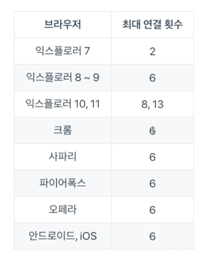
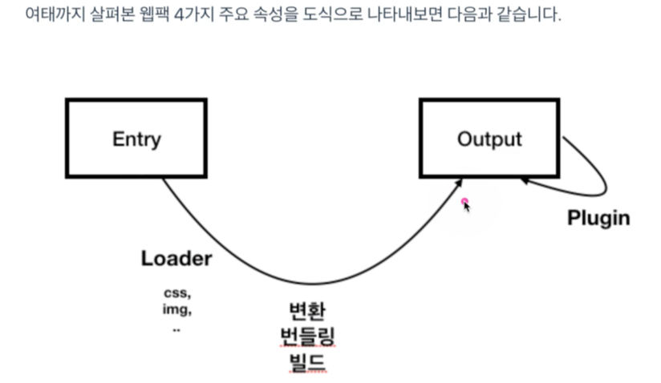

# 웹팩 시작하기
## NPM이란(node package manager)
- javascript 라이브러리를 관리하는 도구이다.
- 패키지 생성
  ```npm
  npm init -y
  ```
- package.json에 lib 의존성이 관리되고 있다.
- 장점
  - 라이브러리간의 의존성관리를 편리하게 할 수 있다.
- npm 전역 설치 옵션 ``--global | -g``
- npm 설치 방법
  ```
  npm [install | i] [lib name] [--global | -g | --save-prod default | --save-dev | -D]
  ```
- ``devDependencies``는 개발을 하기 위한 의존성 모음(배포되지 않음.)
- ``dependencies``는 배포용 의존성 모음
## 웹팩이란?
웹애플리케이션을 구성하는 모듈 번들러다.
- Webpack을 쓰면 서버에 js요청 수가 훨신 줄어든다.
- IIFE(Immediately Invoked Function Expression) 즉시실행함수를 통해 main.js를 구성하고 있다.
- rendering pipeline 이 짧다.
- 웹팩은 js을 위한게 아닌 웹페이지를 구성하는 모든 자원과 관련된 도구다.
### minifier - min버전
### linters - 문법체크
### compile-to-js
### languages
### webpack은 진입점이 하나이다.(js 단일파일 - 설정에따라 다를 수 있따.)
### 등장배경
- js파일에 따라 scope되는게 아닌 전역으로 scope되는 문제가 있으며 es6에 modules이 추가되어 해결!
- 사용하지 않는 라이브러리에 대한 관리가 쉽다.
- 필요한자원을 미리 요청하는게아닌 필요할 때 요청할 수 있다.(dynamic loading | lazy loading)
- 브라우저별 최대 연결 수

  
### devtool: 'source-map' 기능
- prod환경에서도 log찍힌 부분에 대한 난독화된 source를 원 소스로 open해주는 기능
### entry(convert, bundling, build) - 진입점!
- 웹팩에서 빌드할 떄 최초 진입점이자 자바스크립트 경로이자 파일
### output - 결과물!
- 웹팩 build를 하고난 뒤의 결과물 파일 경로/ 파일 정보
### loader(module)
- build할 때 중간에서 자바스크립트가 아닌 파일변환을 도와주는 속성
### plugin
- 추가적인 기능을 제공하는 속성

## Babel 이란?
- 브라우저 호환성에 맞춰 알아서 js를 내려주는 기능

### module.rules.use는 오른쪽에서 왼쪽순서로 적용이 됨.
```text
{
  module: {
    rules: [
      {
        test: /\.css$/,
        use: ['style-loader', 'css-loader']
      }
    ]
  }
}
```

# entry > loader > output > plugins
https://webpack.kr/concepts/

https://webpack.kr/loaders/

https://webpack.kr/plugins/


## 웹팩 DEV 서버 특징
- save시 바로 in-memory 기반 compile 진행
- in-memory기반이므로 output 파일이 생성되지 않음.